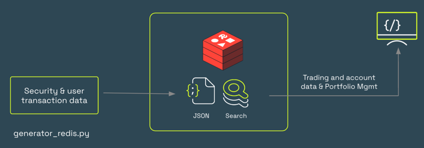
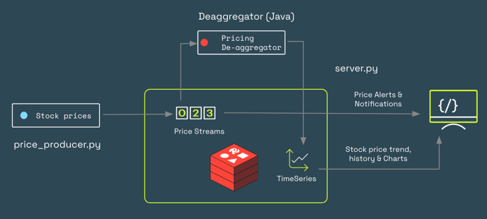

# Sample Securities Portfolio & data model

### Data model

In this repository we are building a sample trading data model. The whole idea is to select a suitable  representational technique to store the data model
that is efficient and extensible at the same time. especially when we are building a trading application. Since, it is imperative to guarantee minimal response time and a higher throughput, we will use native data structures of Redis like JSON and will leverage the Query Engine for indexing and querying the data.
Following are some important entities in this sample application:

1. Investor: This would typically be any type of investor, like retail, corporation etc. Let's choose a retail investor for that matter.

  Key format: `trading:investor:<investorId>`

```json
    {
      "id": "INV10001", 
      "name": "Johny M.", 
      "uid": "35178235834", 
      "email": "johny.m@gmail.com",
      "address": "...",
      "pan": "AHUIOHO684" 
    }
```
    
       id -> unique identifier of the investor
       name -> Name of the investor
       uid -> Unique government id (SSN, Aadhaar etc)
       pan -> Unique taxpayer id provided by government (in India)
       email -> Email address
   
2. Account: This is the unique trading account of the investor. An investor can have multiple account against which the investment might have been made. 
  We will stick to only one account per investor in this demo
  
    Key format: `trading:account:<accountNo>`
    ```json
    {
      "id": "ACC10001",
      "investorId": "INV10001",
      "accountNo": "ACC10001",
      "accountOpenDate": "20/11/2018",
      "accountCloseDate": "NA",
      "retailInvestor": true 
    }
    ```

       id -> unique identifier of the investor
       investorId -> Investor id defined above
       accountNo -> Same as account number
       accountOpenDate -> Date on which this account was opened
       accountCloseDate -> Date on which this account was closed. 'NA' means active a/c
       retailInvestor -> 'true' means retail investor

3. Security lot: This provides the buying information of a security/stock at a particular point in time. An account may 
have multiple such lots at a given time the aggregation of which will provide the total portfolio value.

    Key format: `trading:securitylot:<accountNo>:<securityLotId>`
    ```json
    {
      "id": "SC61239693",
      "accountNo": "ACC10001", 
      "ticker": "ABCBANK",  
      "date": 1665082800, 
      "price": 14500.00, 
      "quantity": 10, 
      "lotValue": 145000,
      "type": "EQUITY"         
    }
    ```
   
       id -> unique identifier of the security lot
       accountNo -> Account number against which the lot was bought
       ticker -> Unique stock ticker code listed in stock exchange
       date -> Date on which this lot was bought
       price -> Price at which the lot was bought. This would be integer. 
                We will use lowest possible currency denomination (Cents, Paisa etc). For that we will multiply the value with 100.
       quantity -> Total quantity of the lot
       lotValue -> Transaction value of the stocks (price * quantity)
       type -> Type of security. For our case, it would be 'EQUITY'
 

4. Stock: This holds the information of the security or stock listed at the stock exchange. We will hold very basic details like name, code etc

    Key format: `trading:stock:<stockId>`
```json
    {
      "id": "NSE623846333",
      "stockCode": "ABCBANK",
      "isin": "INE211111034",
      "stockName": "ABC Bank",
      "description": "Something about ABC bank",
      "dateOfListing": "08/11/1995",
      "active": true
    }
```

       id -> Unique identifier of the security stock
       stockCode -> Unique code of the stock used for trading
       stockName -> Name of the stock
       description -> Description of the stock
       active -> If the stock is available for trading
       
       


## Use cases

### Securities & portfolio management

In this scenario, we will create aforementioned data models like investors, account, security_lot etc.
We will use `data_generators/generator_redis.py` to generate these entity models.

Component diagram:




Sequence of steps:

1. Install necessary libraries


    source venv/bin/activate
    pip3 install -r requirements.txt
    python3 data_generators/generator.py

By default, 1k account data will be generated.
To change this, modify 'ACCOUNT_RECORD_COUNT' env variable

Following files will be used to create the transaction records for the user:

    files/for_tnxs/ABCBANK.csv
    files/for_tnxs/ABCMOTORS.csv

Docker command to execute this script:

    docker run -e HOST=<HOST> -e PORT=<PORT> -e PASSWORD=<PASSWORD> -e ACCOUNT_RECORD_COUNT=1000 abhishekcoder/sample_trading_data_model:generator


2. Next, we would be leveraging Redis Query Engine to provide full-text indexing capabilities on JSON 
   documents. We will execute following secondary indexes:


        FT.CREATE idx_trading_security_lot 
            on JSON PREFIX 1 trading:securitylot: 
        SCHEMA 
            $.accountNo as accountNo TEXT 
            $.ticker as ticker TAG 
            $.price as price NUMERIC SORTABLE 
            $.quantity as quantity NUMERIC SORTABLE 
            $.lotValue as lotValue NUMERIC SORTABLE 
            $.date as date NUMERIC SORTABLE


        FT.CREATE idx_trading_account 
            on JSON PREFIX 1 trading:account: 
        SCHEMA 
            $.accountNo as accountNo TEXT 
            $.retailInvestor as retailInvestor TAG 
            $.accountOpenDate as accountOpenDate TEXT    

3. Now, let's test the scenario by executing following queries using either redis-cli or RedisInsight tool:

   * Get all the security lots by account number/id

         `FT.SEARCH idx_trading_security_lot '@accountNo: (ACC10001)'`

   * Get all the security lots by account number/id and ticker

         `FT.SEARCH idx_trading_security_lot '@accountNo: (ACC10001) @ticker:{ABCMOTORS}'`

   * Get total quantity of all securities inside investor's security portfolio

         `FT.AGGREGATE idx_trading_security_lot '@accountNo: (ACC10001)' GROUPBY 1 @ticker REDUCE SUM 1 @quantity as totalQuantity`

   * Get total quantity of all securities inside investor's security portfolio at a particular time

         `FT.AGGREGATE idx_trading_security_lot '@accountNo:(ACC10001) @date: [0 1665082800]' GROUPBY 1 @ticker REDUCE SUM 1 @quantity as totalQuantity`

   * Get average cost price of the owned stock at a given date and time. If current price of the stock is known, this can also provide the profit and loss information.

         `FT.AGGREGATE idx_trading_security_lot '@accountNo:(ACC10001) @date:[0 1665498506]' groupby 1 @ticker reduce sum 1 @lotValue as totalLotValue reduce sum 1 @quantity as totalQuantity apply '(@totalLotValue/(@totalQuantity*100))' as avgPrice`

   * Get total portfolio value across all the stocks owned by a given account number.

         `FT.AGGREGATE idx_trading_security_lot '@accountNo:(ACC1000)' groupby 1 @ticker reduce sum 1 @lotValue as totalLotValue apply '(@totalLotValue/100)' as portfolioFolioValue`


******************************************************

### Dynamic stock pricing - Streams & Timeseries

Stock price data is highly volatile and requires a real-time data platform to handle this use case. To address this requirement, we will use 
leverage Streams & Timeseries to store the historical and the current stock prices.

Following files (for ABCBANK & ABCMOTORS) are used to push the pricing data into Streams in Redis:

    files/for_pricing_data/ABCBANK_intraday.csv
    files/for_pricing_data/ABCMOTORS_intraday.csv

Sequence of steps:
There are 2 parts here: Pricing data ingestion & Pricing data processing

Component diagram:



#### A. Pricing data - Ingestion

1. Install the pre-requisites 


    source venv/bin/activate
    pip3 install -r requirements.txt

2. We will ingest the intra-day price changes for these securities into Redis Enterprise.:


    python3 price_producer/price_producer.py

The files used to generate intra-day pricing data are present here:

    files/for_pricing_data/ABCBANK_intraday.csv
    files/for_pricing_data/ABCMOTORS_intraday.csv

Above script will push pricing details into `price_update_stream` stream.

    XADD STREAMS * price_update_stream {"ticker":"ABCBANK", "datetime": "02/09/2022 9:00:07 AM", "price": 1440.0}


Docker command to run this script:

    docker run -e HOST=<HOST> -e PORT=<PORT> -e PASSWORD=<PASSWORD> abhishekcoder/sample_trading_data_model:price_producer


#### B. Pricing data - Processing

These dynamic pricing data will be consumed asynchronously by a Streams consumer. The code for streams consumer is present
in '/consumer/pricing-deaggregator' folder and written using Java 21 & Spring Boot.

The docker image for the consumer is: `abhishekcoder/sample_trading_data_model:deaggregator`

This consumer performs following responsibilities:

      1. Consuming the pricing data, remodeling it and disaggregating it based on the stock ticker
      2. Create Timeseries compaction rules (Open, high, Close, Low) based on defined bucket size (default is 5 sec) 
      3. Pushes these pricing info to RedisTimeSeries database in the following key format --> `'price_history_ts:<STOCK_TICKER>'`
      4. This also creates a price notification stream. This may be used by the notification engine to send pricing alerts to users.
      5. [Optional] Push the latest pricing info into a Pub-Sub channel so that the active clients/investors who have subscribed can get the latest pricing notifications

Docker command to execute the de-aggregator:

    `docker run -e SPRING_REDIS_HOST=<HOST> -e SPRING_REDIS_PORT=<PORT> -e SPRING_REDIS_PASSWORD=<PASSWORD> abhishekcoder/sample_trading_data_model:deaggregator`


This consumer will create Timeseries key for tracking price for a security & update the pricing info in the timeseries db whenever it arrives:

    TS.CREATE price_history_ts:ABCBANK ticker ABCBANK DUPLICATE_POLICY LAST
    TS.ADD price_history_ts:ABCBANK 1352332800 635.5

Now, since the RedisTimeSeries database contains all the pricing data for a particular security, we can write some RedisTimeSeries
queries to get the pricing trend, current price, aggregation of the price overtime. We can also use downsampling feature to 
get the trend by days, weeks, months, years etc.

#### Get latest price for a ticker

    TS.GET price_history_ts:ABCBANK

#### Get the price info between two dates/times for a ticker
    
    TS.RANGE price_history_ts:ABCBANK 1352332800 1392602800

#### Create rule for daily average price for a particular security

    TS.CREATERULE price_history_ts:ABCBANK price_history_ts:ABCBANK_AGGR AGGREGATION avg 86400000

******************************************************

### Historical ticker price & volume - Timeseries

One of the important use cases of financial industry is to track and get the deeper insights from the historic stock price
and the volume traded each trading day.
Timeseries data structure provided by Redis provides a real-time data-structure using which we can achieve on-demand 
access to the pricing data at any point in time.

Component diagram:


Sequence of steps:


1. Install the pre-requisites 


    source venv/bin/activate
    pip3 install -r requirements.txt

2. We will ingest the historic pricing data using this script:


    python3 data_generators/report.py

The above script will ingest the data for last 10 years for following stocks in Timeseries data structure:

    files/for_report/ABCBANK.csv
    files/for_report/ABCMOTORS.csv

Docker command to run this script:

    docker run -e HOST=<HOST> -e PORT=<PORT> -e PASSWORD=<PASSWORD> abhishekcoder/sample_trading_data_model:report

******************************************************

### Visualise the complete app

To visualise this on browser, run the `server.py` script included in this repo. When successfully executed, open 
[http://localhost:5555](http://localhost:5555) and observe the data in action. 
You will see the current price, day low, day high and the intra-day trend.

The docker command to start the server:

    docker run -e HOST=<HOST> -e PORT=<PORT> -e PASSWORD=<PASSWORD> \
               -e ticker_trend=True \
               -e report=True \
               -e notification=True \
               -e transactions=True \
    abhishekcoder/sample_trading_data_model:server


Following diagram shows how data flows in and out of the system and how different pieces stitch 
together. 


******************************************************

### Run everything using docker-compose
We can execute the entire application stack using docker-compose. 
The `docker-compose.yaml` file is present in the application directory.
There are various env variable which can be set. 
Change the desired variables in `docker-compose-redis-variables.env` file before executing the 'docker compose up' command. 

    HOST
    PASSWORD
    PORT

Apart from above, following feature flag can also be set. This will help to enable/disable a particular feature.
For instance, to disable Notification and Reporting feature (historical pricing in timeseries), set these env variables:
    
    ticker_trend=True
    report=False
    notification=False
    transactions=True

Wait for a minute and 
open http://localhost:5555 to check the result.

`docker compose up`

To shutdown the applications, execute this command:

`docker compose down`


